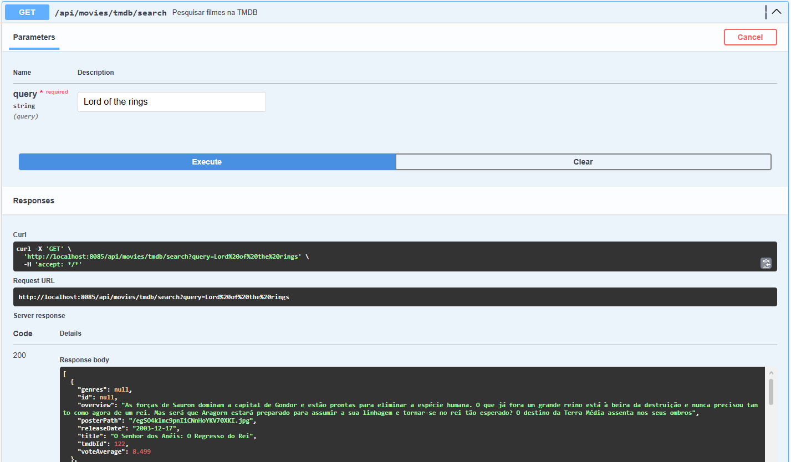
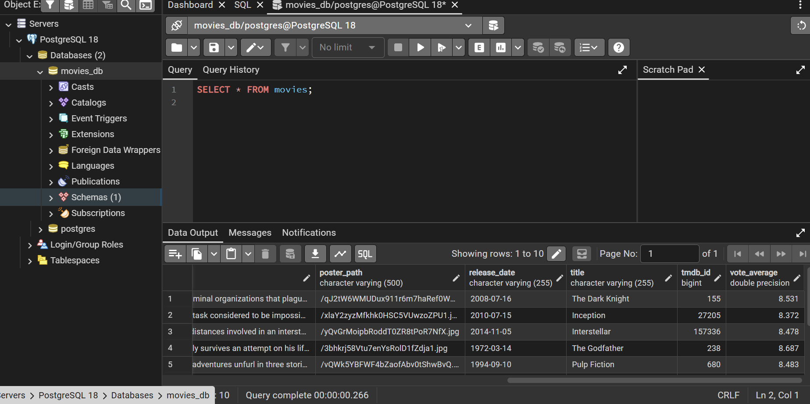
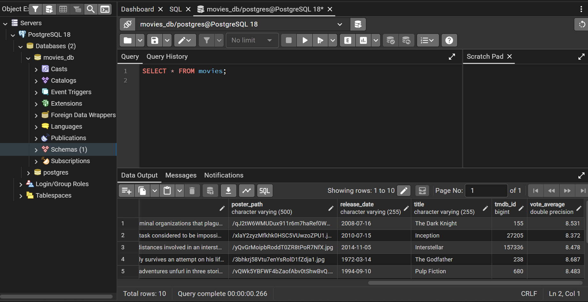
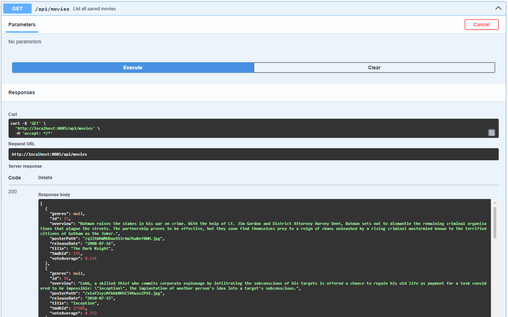
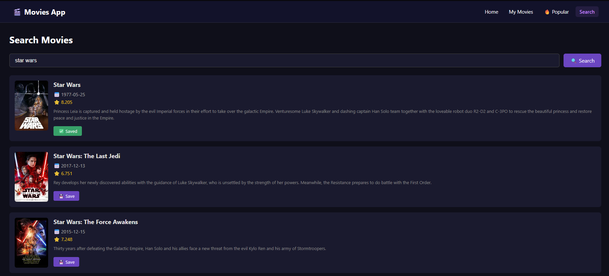
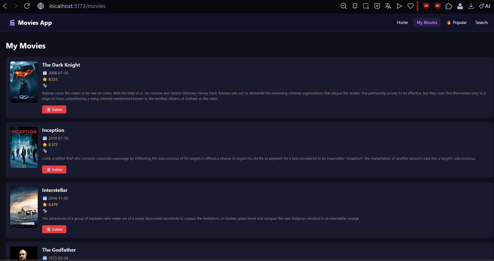
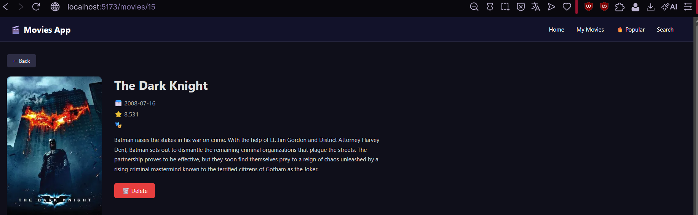
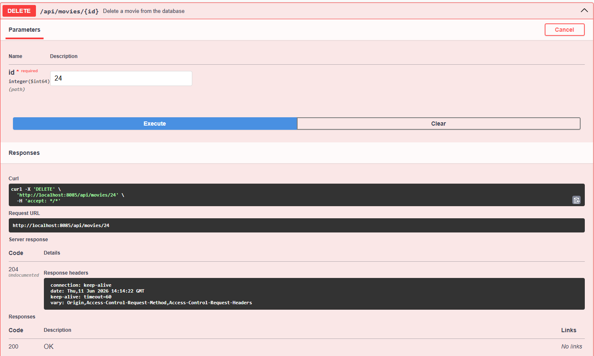

# 🎬 Movies App

A full-stack web application to discover, save and manage movies. Built as a personal project to explore REST API development, Spring Boot, PostgreSQL and React.

---

## 🚀 What it does

- Browse movies from **TMDB (The Movie Database)** public API
- Save movies to a **local PostgreSQL database**
- Full **CRUD** operations on saved movies
- Search movies by title on both TMDB and local database
- Clean and responsive dark UI built with React

---

## 🛠️ Tech Stack

| Layer | Technology |
|---|---|
| **Backend** | Java 17 + Spring Boot 4 |
| **Database** | PostgreSQL |
| **ORM** | Hibernate / Spring Data JPA |
| **API Docs** | Swagger (SpringDoc OpenAPI) |
| **Frontend** | React 19 + Vite |
| **HTTP Client** | Axios |
| **Routing** | React Router DOM |
| **External API** | TMDB API |

---

## 📁 Project Structure

```
movies-app/
├── backend/                        # Spring Boot API
│   └── src/main/java/movies_api/
│       ├── client/
│       │   └── TmdbClient.java     # TMDB API integration
│       ├── config/
│       │   └── CorsConfig.java     # CORS configuration
│       ├── controller/
│       │   └── MovieController.java
│       ├── dto/
│       │   └── MovieDTO.java
│       ├── model/
│       │   └── Movie.java
│       ├── repository/
│       │   └── MovieRepository.java
│       ├── service/
│       │   └── MovieService.java
│       └── DemoApplication.java
│
└── frontend/                       # React App
    └── src/
        ├── components/
        │   └── Navbar.jsx
        ├── pages/
        │   ├── HomePage.jsx
        │   ├── MoviesPage.jsx
        │   ├── MovieDetailPage.jsx
        │   ├── PopularPage.jsx
        │   └── SearchPage.jsx
        └── services/
            └── movieService.js
```

---

## ⚙️ Prerequisites

Make sure you have the following installed:

- [Java 17+](https://adoptium.net)
- [Maven](https://maven.apache.org)
- [PostgreSQL](https://www.postgresql.org/download)
- [Node.js 18+](https://nodejs.org)
- A TMDB API key —[themoviedb.org](https://www.themoviedb.org/settings/api)

---

## 🔧 Setup & Installation

### 1. Clone the repository

```bash
git clone https://github.com/traquinices/movies-app.git
cd movies-app
```

### 2. Create the database

Open pgAdmin or a PostgreSQL terminal and run:

```sql
CREATE DATABASE movies_db;
```

### 3. Configure the backend

Open `backend/src/main/resources/application.properties` and update:

```properties
spring.datasource.url=jdbc:postgresql://localhost:5432/movies_db
spring.datasource.username=postgres
spring.datasource.password=your_password

tmdb.api.key=your_tmdb_api_key
tmdb.api.base-url=https://api.themoviedb.org/3

server.port=8085
```

### 4. Run the backend

```bash
cd backend
mvn spring-boot:run
```

The API will be available at `http://localhost:8085`

### 5. Install frontend dependencies

```bash
cd frontend
npm install
```

### 6. Run the frontend

```bash
npm run dev
```

The app will be available at `http://localhost:5173`

---

## 📖 API Endpoints

All endpoints are documented via Swagger at:
```
http://localhost:8085/swagger-ui/index.html
```

### Local Database (CRUD)

| Method | Endpoint | Description |
|---|---|---|
| GET | `/api/movies` | List all saved movies |
| GET | `/api/movies/{id}` | Get movie by ID |
| POST | `/api/movies` | Save a movie manually |
| PUT | `/api/movies/{id}` | Update a movie |
| DELETE | `/api/movies/{id}` | Delete a movie |
| GET | `/api/movies/search?title=x` | Search saved movies by title |

### TMDB Integration

| Method | Endpoint | Description |
|---|---|---|
| GET | `/api/movies/tmdb/popular` | Get popular movies from TMDB |
| GET | `/api/movies/tmdb/search?query=x` | Search movies on TMDB |
| GET | `/api/movies/tmdb/{tmdbId}` | Get movie details from TMDB |
| POST | `/api/movies/tmdb/{tmdbId}/save` | Save a TMDB movie to local DB |

---

## 🎯 How to use

### Save a movie manually via Swagger

Go to `POST /api/movies` and use this example body:

```json
{
  "tmdbId": 27205,
  "title": "Inception",
  "overview": "A thief who enters the dreams of others to steal secrets from their subconscious.",
  "posterPath": "/9gk7adHYeDvHkCSEqAvQNLV5Uge.jpg",
  "releaseDate": "2010-07-16",
  "voteAverage": 8.4,
  "genres": "Action, Science Fiction, Adventure"
}
```

### Save a movie directly from TMDB

```
POST /api/movies/tmdb/27205/save
```

This fetches all movie data from TMDB automatically and saves it to the database.

---

## 🖥️ Frontend Pages

| Page | Route | Description |
|---|---|---|
| Home | `/` | Landing page with navigation |
| My Movies | `/movies` | List of all saved movies, click to see details |
| Movie Detail | `/movies/:id` | Full details of a saved movie with delete option |
| Popular | `/popular` | Top movies from TMDB with save option |
| Search | `/search` | Search TMDB and save results |

---

## 📸 Screenshots

## 1. Searching TMDB for "Lord of the rings" (Swagger)


## 2. PostgreSQL table `movies` – data view (pgAdmin)


## 3. Query results – saved movies (pgAdmin)


## 4. GET `/api/movies` – JSON response of saved movies


## 5. Frontend – search page with Star Wars results


## 6. Frontend – "My Movies" list


## 7. Frontend – movie details page (The Dark Knight)


## 8. DELETE `/api/movies/{id}` – successful 204 response (Swagger)


---

## 🧠 What I learned

- Building a RESTful API with Spring Boot following REST principles
- Integrating a third-party public API (TMDB) in a Java backend
- Using Spring Data JPA and Hibernate to manage a PostgreSQL database
- Configuring CORS to allow communication between frontend and backend
- Building a React SPA with routing, state management and API calls with Axios
- Structuring a full-stack project with separation of concerns

---

## 📄 License

MIT — feel free to use and modify for your own learning.
